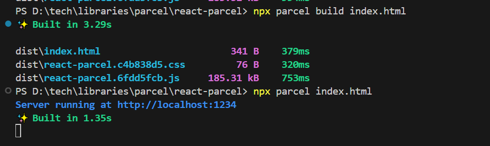

# react-parcel-bundler

## Lession 1:

- Added a normal h1 tag in .index.html and executed it on browser
- Created a h1 tag using **_JavaScript_** and appended it to **_root_** div tag
- Injected React CDN links to index.html, this is one of the way to get the React/ReactDOM into the project

-> React is the core library used to work with react elements : React.createElement("h1", {id:1}, "Hellow World!")
-> ReactDOM is like bridge b/w React Elements and Browser -> mainly it helps to create/update DOM elements: ReactDOM.createRoot(document.getElementById("root")) -> root.render(ReactElement)

## Lession 2:

-> NPM: Package Manager for Node
-> Biggest package manager, all the libraries/utilities are hosted
//-------------------
node -v
npm -v
//-------------------

- Initialize the npm to your project: npm init --> it creates a package.json
- configuration file for npm & maintaince the version of the all the dependencies/packages
  - install packages: npm install package-name / npm i package-name
    **_ BUNDLER: parcel _**
    -> npm install --save-dev parcel
    -> this package will be installed as a devDependency. it is only required during development.
    -> currently, installed: "parcel": "^2.14.4" -> "Major.Minor.Patch"
    -> ^ : carret -> minor version get updates automatically if any minor upgrades are released
    -> ~ : tilde -> only the patch gets updated automatically
    -> package-lock.json : it keeps track of the exact version of the package installed.
    ex. package.json : "parcel": "^2.14.4" -> if new patch was released "^2.14.6"
    package-locj.json will lock the updated version and it will have all dependented packages as well, those are called transitive dependencies.
    -> node_modules: this folder contains all the package code fetched from npm and it has installed all the dependent packages asll into it: kind of database of all the packages.
- Added .gitignore
  -> will ignore all the files while pusing to github
  -> package.json and package-lock.json should be pushed to github -> same development environment can be creted on production as package-lock.json will have all the exact version of each package
- Ignited the app using parcel: npx parcel index.html [Server running at http://localhost:1234]
  -> npm: to install the package
  -> npx: to execute the package
- Installed react and react-dom: npm i react react-dom
  -> this is the another way to get the packages and it is a good way. Don't prefer CDN links on Productions
  -> these packages are installed as a normal dependencies
  -> Add the type="module" attribute to the "<script> tag" -> else it won't work with import

**_parcel is a beast_**

- Dev Build
- Local server
- HMR : Hot Module Replacement
- File watching algorithm - written c++ : Reflect on the page if there is any change in the file
- Caching - Faster builds (parcel-cache)
- Image optimazation
- Minification
- Bundling the files (.js, html, css)
- Compressing the files
- Consistent hasing
- Code spliting - lazy loading
- Differential bundling: to support older browsers. it provides different bundles
- Error diagnostic, it helps for error handling
- It helps to create https also
- Tree shaking : removes un-used code
- It creates different build for development and production

**_dev build_**

```js
PS D:react-parcel> npx parcel build index.html
Server running at http://localhost:1234
✨ Built in 1.35s
```

**_production build using parcel_**

```js
PS D:react-parcel> npx parcel build index.html
✨ Built in 3.29s
dist\index.html                       341 B    379ms
dist\react-parcel.c4b838d5.css         76 B    320ms
dist\react-parcel.6fdd5fcb.js     185.31 kB    753ms
```

```js

```
